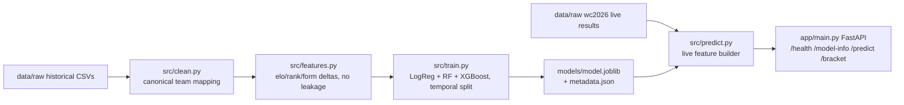

# World Cup 2026 Live Knockout Predictor API


REST API (FastAPI) that predicts win probabilities for FIFA World Cup 2026
knockout matches, using historical international results, FIFA ranking as
an Elo-style proxy, and **live 2026 tournament context** (not mixed into
training). This is a learning/demo MVP, not a betting engine — the goal is
a correct, reproducible pipeline, not maximum accuracy.

## Table of contents
- [Architecture](#architecture)
- [Quickstart](#1-quickstart-fresh-clone)
- [Data sources](#2-data-sources)
- [Repository structure](#3-repository-structure)
- [Key design decisions](#4-key-design-decisions)
- [Endpoints](#5-endpoints)
- [License](#6-license--attribution)

## Architecture



## 1. Quickstart (fresh clone)

```bash
git clone <this-repo>
cd worldcup-predictor
python3 -m venv .venv && source .venv/bin/activate   # or your preferred env tool
pip install -r requirements.txt
```

### Rebuild data + retrain the model
```bash
python -m src.clean       # canonical team names, cleaned CSVs -> data/processed/
python -m src.features    # feature engineering -> data/processed/training_features.csv
python -m src.train       # trains + saves models/model.joblib + models/metadata.json
```

### Run the API
```bash
uvicorn app.main:app --reload
```
Visit http://127.0.0.1:8000/docs for interactive Swagger docs.

### Example request
```bash
curl "http://127.0.0.1:8000/predict?team_a=France&team_b=Brazil"
```
```json
{
  "team_a": "France",
  "team_b": "Brazil",
  "win_a": 0.6979,
  "win_b": 0.3021,
  "model_version": "wc2026-knockout-v1",
  "confidence": "high",
  "features_used": ["elo_delta", "rank_delta", "recent_form_delta", "goal_diff_recent_delta", "rest_days_delta"]
}
```

### Run tests
```bash
pytest tests/ -v
```

### Docker (optional)
```bash
docker build -t worldcup-predictor .
docker run -p 8000:8000 worldcup-predictor
```
Note: build/train the model **before** building the image (`models/model.joblib`
must exist), or uncomment the training line in the `Dockerfile`.

## 2. Data sources

| File | Source | Role |
|---|---|---|
| `data/raw/international_results.csv` | [martj42/international_results](https://github.com/martj42/international_results) — 49k+ international matches, 1872–present | Training / backtest |
| `data/raw/shootouts.csv` | same repo | Resolves knockout draws (extra-time/penalty winner) |
| `data/raw/fifa_ranking_historical.csv` | [Dato-Futbol/fifa-ranking](https://github.com/Dato-Futbol/fifa-ranking) — Dec 1992–Sep 2024 | Elo/ranking-strength proxy |
| `data/raw/wc2026_matches_detailed.csv` | [mominullptr/FIFA-World-Cup-2026-Dataset](https://github.com/mominullptr/FIFA-World-Cup-2026-Dataset) | **Live 2026 context only**, never used for training |

All raw files are downloaded as-is and never edited manually. All cleaning
happens in `src/clean.py` (canonical team-name mapping, e.g. "Cabo Verde" →
"Cape Verde", "Türkiye" → "Turkey").

## 3. Repository structure
```
worldcup-predictor/
  app/            FastAPI app (main.py, schemas.py)
  data/raw/       Original downloaded CSVs (untouched)
  data/processed/ Cleaned + feature-engineered CSVs (generated by src/*)
  models/         model.joblib (model+scaler), metadata.json
  notebooks/       01_eda.ipynb
  src/             ingest/clean/features/train/evaluate/predict scripts
  tests/           pytest unit + API smoke tests
```

## 4. Key design decisions
- **Target**: binary `team_a_win` (1) vs `team_b_win` (0) — the final match
  winner after extra time/penalties. Draws with no shootout record (i.e.
  genuine non-knockout draws in the historical data) are dropped from the
  binary training set.
- **Temporal split** (no random split): train on matches before 2018-01-01,
  test on 2018-01-01 onward (covers WC 2018 + WC 2022). This avoids the
  data leakage of training on a team's future results.
- **Live vs training data**: World Cup 2026 results are never added to the
  training set. They are only used at inference time to compute
  `world_cup_2026_goal_diff_delta` and to update "recent form" context. The
  model is **not retrained** as new 2026 results arrive.
- See `REPORT.md` for full metrics, feature list, and limitations.

## 5. Endpoints
| Endpoint | Description |
|---|---|
| `GET /health` | liveness check |
| `GET /model-info` | model version, training date, features, backtest metrics |
| `GET /predict?team_a=X&team_b=Y` | win probability for X vs Y |
| `GET /bracket` | (bonus) predictions for every remaining scheduled WC2026 match |

## 6. License / attribution
Historical datasets are used under their original open licenses (see links
above). This project itself is for internship learning purposes.
